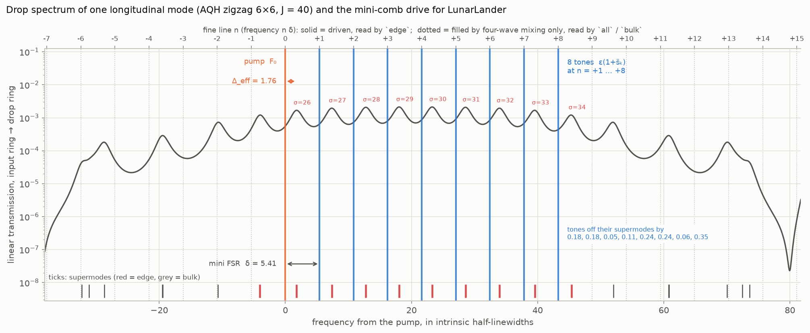
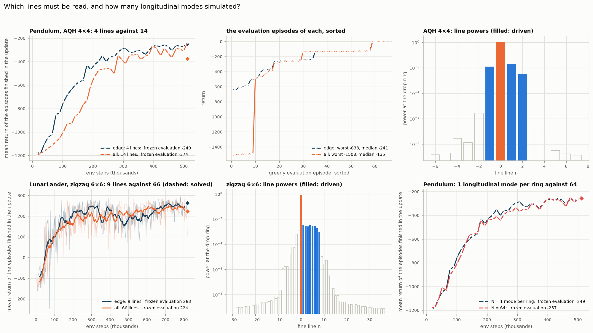
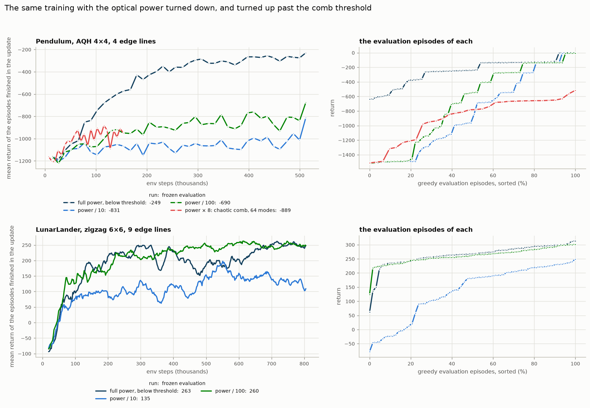

# The coupled-ring lattice extension

This note documents what was added to the single-ring repository: a 2D lattice of coupled Kerr
microrings whose **edge supermodes, inside one longitudinal mode, carry the inputs** — a mini-comb —
used as the policy's feature map in place of the single ring. It covers the idea, the model, the
implementation, how it was validated, and the first results.

## Why

The single ring establishes the principle with its longitudinal modes as channels: one input per
comb line, read-out of the comb lines. But those lines are one FSR apart — of the order of a THz
for a microring — far beyond what a modulator can write or a detector resolve directly. This is
what the lattice is for: inside ONE longitudinal mode sit its R supermodes σ (eigenvalues λ_σ of the
coupling matrix H), the edge supermodes of a topological lattice are nearly equidistant, and their
spacing is set by the ring-ring coupling, i.e. it is of the order of a GHz. Replacing "longitudinal
modes, one FSR apart" by "edge supermodes, one mini FSR apart" brings the same scheme into the
range of ordinary electronics: for a linewidth κ/2π = 200 MHz the numbers below (J = 20, δ = 10.9)
mean a coupling of 2 GHz, a mini FSR of 1.1 GHz and four read-out lines within 3.3 GHz, so that one
modulator writes all tones and a heterodyne measurement of the drop port reads all lines.

## The model (`microring/lattice.py`)

Each of the R rings carries longitudinal modes m; rings are coupled site-to-site by a tight-binding
Hamiltonian H that is the same for every longitudinal mode:

$$\partial_t a_{r,m} = \left[-(1+i\Delta) - i d_2 m^2\right] a_{r,m} - i\sum_{r'} H_{rr'} a_{r',m} - \kappa_{ex,r} a_{r,m} + i(|\psi|^2\psi)_{r,m} + F_{r,m}$$

in the units of the single-ring LLE: time in photon lifetimes 2/κ_in, so the intrinsic loss rate is
1 and every other rate (J, κ_ex, Δ, δ) is in units of the intrinsic half-linewidth. κ_ex is the extra
loading of the rings that carry a bus coupler (the input ring and the drop ring).

Three lattices, with the conventions of the standalone
[Topological Photonic Lattice Explorer](https://github.com/lidaxu-physics/Topological_Photonics_Nonlinear_Explorer)
(the test compares the matrices element by element):

* **`H_IQH`** — integer-quantum-Hall analogue (Hafezi lattice): a uniform synthetic flux per
  plaquette, chiral edge states.
* **`H_AQH`** — anomalous-quantum-Hall (Haldane-type) analogue: staggered phases plus
  same-sublattice diagonal hoppings; its edge band sits at the band centre.
* **`H_zigzag`** — the AQH lattice cut with zigzag edges, R = nx(ny−1) + ny(nx−1) rings. Its edge
  band is more linear: many more, and more evenly spaced, edge supermodes for its size.

**The drive: a mini-comb inside one longitudinal mode.** The pump sits on one edge supermode σ_p and
one tone on each of d others, all in the longitudinal mode m = 0 and all entering the same corner
ring:

$$F_{r,m}(t) = \delta_{r,\mathrm{in}}\delta_{m,0}\left[F_0 + \sum_k \varepsilon(1+\tilde s_k)e^{-i n_k\delta t}\right]$$

with n_k = σ_k − σ_p and δ the **mini FSR**. This is the equidistant drive of the single ring with
the FSR replaced by δ.


The figure (`characterization/05_mini_comb_drive.py`) shows every quantity of this formula for the
preset, on the linear drop spectrum of the pump's longitudinal mode — the transmission from the
input ring to the drop ring of a weak probe at frequency ω from the pump,
|[(1 + i(Δ − ω)) + κ_ex + iH]⁻¹|² taken between those two rings. The ticks at the bottom mark where
each of the 16 supermodes is resonant (red: edge supermodes, ≥ 85 % of their weight on the boundary
rings; grey: bulk). The top axis counts the fine lines n δ that can be read: the solid ones are
driven, the dotted ones can only be filled by four-wave mixing.

1. **Supermodes σ, eigenvalues λ_σ.** Diagonalise H; σ numbers its eigenvalues in ascending order
   (`supermode_table()` also lists boundary weight and port overlaps). Supermode σ is resonant at
   ω = Δ + λ_σ: these are the peaks. The four in the figure are the edge supermodes σ = 6, 7, 8, 9
   of the AQH 4 × 4 lattice, λ = −16.53, −5.29, +5.29, +16.53 at J = 20.
2. **Pump supermode σ_p and detuning Δ.** σ_p is the edge supermode the input ring couples to best
   (here σ_p = 7; `--pump_sigma` overrides). Δ is then set so that this supermode sits at
   Δ_eff = Δ + λ_σp = 1.76: the pump (orange, ω = 0) is 1.76 half-linewidths to the red of its
   peak. Here Δ = 1.76 + 5.29 = 7.05.
3. **Tone supermodes σ_k and rungs n_k = σ_k − σ_p.** One of the remaining edge supermodes per
   input (here 6, 8, 9, so n = −1, +1, +2; `--tone_sigma` overrides). Their exact distances from
   the pump's supermode are Ω_k = λ_σk − λ_σp = −11.23, +10.59, +21.82.
4. **Mini FSR δ.** The Ω_k are only nearly multiples of one spacing. δ is the spacing that fits
   them best in the least-squares sense with the pump as rung 0, δ = Σ n_k Ω_k / Σ n_k²
   = (11.23 + 10.59 + 2 × 21.82) / 6 = 10.91. The tones (blue) are driven at n_k δ = −10.91, +10.91,
   +21.82, not at Ω_k: they miss their supermodes by |n_k δ − Ω_k| = 0.32, 0.32 and 0.00, a quarter
   of the loaded half-linewidth (1.2–1.3). Like the pump, each then sits about 1.76 to the red of
   its peak.
5. **Amplitudes.** F₀ is the pump amplitude; tone k has amplitude ε(1 + s̃_k), where s̃_k in [−1, 1]
   is the squashed k-th observation. All of them enter the input ring only (δ_{r,in}) and the
   longitudinal mode m = 0 only (δ_{m,0}).

By default the pump takes the edge supermode
the input corner couples to best (`--pump_sigma` overrides it) and the tones the neighbouring edge
supermodes that are most evenly spaced (`--tone_sigma`); supermodes that are not close to
equidistant — a tone more than 1 off its supermode — are refused. The pump's supermode is placed at
effective detuning Δ_eff = Δ + λ = 1.76 (`--Delta` overrides), so pump and tones are red-detuned
from their supermodes by 1.76 half-linewidths.

**Readout.** Only the output of the drop ring is used. Its field in the pump's mode, a(t), is
Fourier transformed over the averaging window, and the features are the powers of the lines n δ —
what a heterodyne measurement or a spectrometer with a resolution below δ gives at the drop port.
The frequencies are those of the drive: the drive is periodic (period 2π/δ), so below the comb
threshold the response is, too, and its lines can only sit at n δ. δ is rounded (by less than 1 %)
so that a period is a whole number of solver steps and of samples, and the window a whole number of
periods; the lines are then exactly orthogonal, and a held input gives the same features at every
call (to 1e−5). `--mini_comb` selects the lines:

* `edge` (default): the lines of the driven supermodes;
* `all`: every line in the band of H;
* `bulk`: the latter without the former, i.e. only light that four-wave mixing put there.

**One longitudinal mode is enough.** With pump and tones on m = 0 and the pump below the comb
threshold, the other longitudinal modes stay empty (exactly zero in a 64-mode simulation), so the
preset keeps one mode per ring (`--N` adds more).

**Integrator.** The exact-flow Strang splitting of `LLESolver`, with the linear + drive sub-flow now
a matrix ODE per longitudinal mode, `da_m/dt = L_m a_m + F_m(t)`, `L_m = c_m I − iH_aug`,
`H_aug = H − i·diag(κ_ex)`. One eigendecomposition of H_aug gives every propagator and the response
to a tone at frequency Ω exactly,

```
E_m(h) = V diag(exp(z h)) V⁻¹        W(h) = V diag((exp(z h) − exp(−iΩ h)) / (z + iΩ)) V⁻¹,   z = c_m − iλ
```

so the only error is the O(dt²) splitting error, which needs J·dt ≪ 1. The solver clock t (the
carrier phases of the tones) is part of the state of the lattice: checkpoints and `calibrate()`
save and restore it.

**Geometry.** Input is the corner ring (0, 0); the drop ring is the corner the edge current of the
selected band reaches: (nx−1, 0) for IQH, (0, ny−1) for AQH (it receives 8× the light of the IQH
corner at J = 5 and 1.8× at J = 20 on 4 × 4, where little is lost per round trip), the corner
(1, 2ny−1) for zigzag (3× the opposite one on 6 × 6). `--drop_site r` reads another ring.

## Which lattice for which task

One edge supermode per input plus one for the pump.

| lattice | rings | edge supermodes | spacing at J = 20 | enough for |
|---|---|---|---|---|
| AQH 4 × 4 | 16 | 4 (σ = 6…9) | 11.23, 10.59, 11.23 | Pendulum (3 inputs) |
| AQH 12 × 12 | 144 | 8 usable | 3.9–4.5 | CartPole (4) |
| zigzag 4 × 4 | 24 | 10 | 4.5–11.6 | Pendulum, CartPole |
| zigzag 6 × 6 | 60 | 10 (σ = 25…34) | 2.6–2.9 | LunarLander (8) |

The spacing shrinks with the perimeter and grows with J, so a larger lattice wants a larger J to
keep its supermodes resolved (loaded half-linewidth 1.1–1.3): zigzag 6 × 6 at J = 40 has δ = 5.4 and
its nine drive lines within 0.35 of their supermodes. The pump has to grow as well, because it
spreads over all boundary rings: at F₀² = 100 the pump line carries 1.1 per ring on the AQH 4 × 4
lattice but 0.29 on AQH 12 × 12 and less on zigzag 6 × 6, where the mixing products are then four
orders below the tone lines.



The drive used for LunarLander on zigzag 6 × 6 at J = 40, drawn like the figure of the preset: the
ten edge supermodes are σ = 25…34 (red ticks). The pump sits on σ = 26, the second of them, and the
eight tones on σ = 27…34, i.e. n = +1…+8 — all inputs on one side of the pump, as in the single
ring. δ = 5.41, and the tones miss their supermodes by 0.05–0.35. The tenth edge supermode (σ = 25,
at n = −1) is not driven, and beyond n = +8 the lines fall between bulk supermodes.

## The preset (`REGIMES["topo"]` in `microring/__init__.py`)

| parameter | value | why |
|---|---|---|
| lattice | AQH 4 × 4, flux π/4 | four edge supermodes: the pump and the three inputs of the pendulum |
| J | 20 | supermodes 10.6–11.2 apart against a loaded half-linewidth of 1.2–1.3: a tone has 84–92 % of its energy on the supermode it aims at |
| pump / tones | σ = 7 / 6, 8, 9 | n = −1, +1, +2; δ = 10.91, tones about 0.3, 0.3 and 0 from their supermodes |
| Δ | auto | the pump's supermode at Δ_eff = 1.76 |
| F₀², ε | 100, 0.6 | below the comb threshold; pump line 1.1, tone lines 0.01–0.02 at the drop ring |
| N | 1 | the other longitudinal modes stay empty |
| dt | 0.005 | J·dt = 0.1 |
| T_relax / T_avg | 3 / 10 | T_avg is rounded to whole periods of the mini-comb (17 periods, 9.78) |
| κ_ex | 1 | on the input ring and the drop ring |

64 lattices in parallel take 0.7 s per control step (2 s for 144 rings).

## Results

Frozen greedy evaluation, one seed each. "Modes μ" is the number of longitudinal modes simulated
per ring: 1 means μ = 0 alone, the mode of the pump and the tones; 64 means μ = −32…31. F₀² is the
pump power and ε the tone amplitude at zero input (a tone has power ε²(1 + s̃)², at most 4ε²), both
in the normalised units of the LLE, the same as for the single ring (whose chaos preset is F₀² = 10,
ε = 0.6). "Lines" is what the policy reads: `edge` the lines of the driven supermodes, `all` every
line in the band.

| task | lattice | modes μ | F₀² | ε | lines (features) | return | worst / best episode |
|---|---|---|---|---|---|---|---|
| Pendulum | AQH 4 × 4 | 1 (μ = 0) | 100 | 0.6 | `edge` (4) | **−249 ± 175** | −638 / −2 |
| Pendulum | AQH 4 × 4 | 1 (μ = 0) | 100 | 0.6 | `all` (14) | −374 ± 469 | −1508 / −1 |
| Pendulum | AQH 4 × 4 | 64 | 100 | 0.6 | `edge` (4) | −257 ± 178 | −693 / −2 |
| Pendulum, power / 10 | AQH 4 × 4 | 1 (μ = 0) | 10 | 0.19 | `edge` (4) | −831 ± 531 | −1519 / −6 |
| Pendulum, power / 100 | AQH 4 × 4 | 1 (μ = 0) | 1 | 0.06 | `edge` (4) | −690 ± 540 | −1519 / −5 |
| Pendulum, chaotic comb | AQH 4 × 4 | 64 | 800 | 3.0 | `edge` (4) | −889 ± 291 | −1514 / −516 |
| LunarLander | zigzag 6 × 6 | 1 (μ = 0) | 1000 | 1.0 | `edge` (9) | **+263 ± 41** | +62 / +313 |
| LunarLander | zigzag 6 × 6 | 1 (μ = 0) | 1000 | 1.0 | `all` (66) | +224 ± 81 | −21 / +299 |
| LunarLander, power / 10 | zigzag 6 × 6 | 1 (μ = 0) | 100 | 0.32 | `edge` (9) | +135 ± 95 | −78 / +249 |
| LunarLander, power / 100 | zigzag 6 × 6 | 1 (μ = 0) | 10 | 0.10 | `edge` (9) | +260 ± 28 | +124 / +301 |

All runs but the chaotic comb are below the comb threshold of their lattice (about F₀² = 100–150 on
AQH 4 × 4, between 1000 and 1600 on zigzag 6 × 6), where the modes μ ≠ 0 stay empty. The chaotic comb
was evaluated over 32 episodes, all others over 64. J = 20 on AQH 4 × 4 and 40 on zigzag 6 × 6.

For comparison (frozen evaluations of the single-ring part of this repository): on the pendulum a
linear policy reaches −718…−1038 and the best single-ring regime −196…−252; on LunarLander the
linear policy +7…+106 and the best single ring +255…+263 (solved means above 200). So the mini-comb
reaches the level of the single ring on both tasks, from one longitudinal mode, with as many
read-out lines as there are drive lines. Whether the lattice's nonlinearity is what does it is
question 3 below: on the pendulum yes, on LunarLander no. In the simulation of the pendulum
99.5 % of the light is in the four edge supermodes and 99.9 % on the boundary rings.

**LunarLander on zigzag 6 × 6.** J = 40, dt = 0.0025, pump on σ = 26, tones on σ = 27…34, F₀² = 1000,
ε = 1, T_relax = 2, T_avg = 3.5 (three periods of the mini-comb), 400 updates:

```
python PPO_MR.py --env LunarLander-v3 --regime topo --lattice zigzag --nx 6 --ny 6 --J 40 --dt 0.0025 \
                 --pump_sigma 26 --F0 31.6228 --eps 1.0 --T_relax 2 --T_avg 3.5 --out_dir lattice_results/aqh_66zigzag_results/pattern_free
```

The pump power has to be chosen against the comb threshold of this lattice, with all longitudinal
modes simulated: at F₀² = 1600 a quarter to a third of the light leaves m = 0 (and a single-mode
simulation, which cannot show it, is then wrong); at F₀² = 1000 nothing does, also with all eight
tones at their largest amplitude 2ε = 2, while tones of amplitude 4 push it over the threshold.
Hence F₀² = 1000 and ε = 1.

## Three questions the runs are meant to answer

**1. Is one longitudinal mode per ring enough?** The claim is that below the comb threshold the
light never leaves the pump's longitudinal mode, so that the other modes need not be simulated.
In a 64-mode simulation of the preset, the power outside m = 0 is exactly zero after the warm-up,
and the features computed with 1 and with 8 modes per ring agree to better than 1e−3 (test 7). The
reason: pump and tones are all on m = 0, and four-wave mixing among them conserves m; the only way
out is modulational instability, which the pump is kept below. So the single mode is not an
approximation below threshold; it is what the dynamics does. The training confirms it (bottom
right of the figure below): the Pendulum run repeated with 64 modes per ring follows the single-mode
one — the two learning curves differ by 22 on average, within the scatter of such curves — and ends
at −257 ± 178 against −249 ± 175, for six times the computing time (135 s per update against 23 s).

Above the threshold this is no longer true. With the pump alone on the AQH 4 × 4 lattice, light
appears on other longitudinal modes between F₀² = 100 and 150 (14 % of it at 150, 30–40 % at
200–300, stationary rolls; time dependent from about 500). A simulation with one mode per ring
stays stationary up to F₀² = 800 and starts to oscillate, on lines half a mini FSR apart, only at
about 1600. So the comb that forms first is the one across longitudinal modes, an order of
magnitude in pump power before a mini-comb would form by itself: the mini-comb has to be seeded by
the tones, below threshold, and anything above threshold has to be simulated with all modes.

**2. Must every line be read, or do the lines of the edge supermodes suffice?** `edge` reads the
lines at the drive frequencies (solid in the figures above), `all` every line n δ in the band of H.



(`characterization/06_two_questions.py` redraws the figure from the result files of finished runs.)

On the pendulum (AQH 4 × 4) the four edge lines suffice: that policy learns faster (left) and never
fails — frozen evaluation −249 ± 175, worst episode −638. The policy that reads all 14 lines
(−374 ± 469) is not simply worse, though (middle). In 55 of its 64 evaluation episodes it is the
better one (median −135 against −241), and in the other 9 it never swings up (about −1500), which
is what pulls its mean down. The ten extra lines carry 10⁻⁶ and less (right), three to four orders
below the tone lines: after standardisation they give the readout more to fit and, from some
initial conditions, more to go wrong with. One seed each, so the ranking of the means is not
settled; that four lines are enough to solve the task is.

On LunarLander (zigzag 6 × 6, bottom left) the same holds: the nine edge lines give +263 ± 41, all
66 lines +224 ± 81, and again the policy with more lines has the worse worst case (−21 against
+62). On this lattice the lines next to the driven ones are not empty (bottom middle): the tenth
edge supermode at n = −1 and the lines beyond n = +8 carry 10⁻³ to 10⁻⁵ of the pump line, up to the
level of the weakest tone line. They still do not help.

What `edge` sufficing does and does not mean: the edge lines sit at the drive frequencies and
contain the linearly transmitted tones as well as the mixing products. `--mini_comb bulk`, which
reads only lines that four-wave mixing fills, is the control that separates the two; it has not
been run yet. And every number here is one seed.

**3. Does the lattice compute, or does detecting powers suffice?** Even a linear lattice gives a
nonlinear feature when a power is detected: the edge line of tone k is then |ε(1 + s̃_k)|², the
square of its own input, with no mixing between the inputs. The control is the same training with
the light turned down: pump and tones scaled together (F₀² and ε² by 1/10 and 1/100), so that the
drive keeps its shape and every four-wave-mixing product weakens with it. The features are
standardised before the readout, so nothing else changes.



(`characterization/07_power_control.py`.) On the pendulum the answer is clear: at a tenth and at a
hundredth of the power the policy ends at −831 ± 531 and −690 ± 540, the level of the linear policy
without any lattice (−718…−1038), against −249 ± 175 at full power. Like the linear policy, the
low-power ones swing up from some initial conditions and never from others (right panel). The
squares that power detection provides are not enough for this task; what the full-power lattice
adds — the mixing of different inputs by four-wave mixing between the edge supermodes — is what
solves it. (That −690 is better than −831 is within the scatter of such runs.)

LunarLander gives the opposite answer (bottom row). At a hundredth of the power the policy lands as
well as at full power, +260 ± 28 against +263 ± 41: the squares of the individual inputs, which
power detection provides without any lattice nonlinearity, are enough for this task (explicit
quadratic features also solve it, and a purely linear policy does not, +7…+106). So the +263 of
the mini-comb on LunarLander is no evidence that the lattice computes; the pendulum is. At a tenth
of the power the same training ends at +135 ± 95, no better than the linear policy. Why the
intermediate power is the worst of the three — on both tasks — is not understood; with one seed
per point it may also be chance, and it is the first thing more seeds should settle.

The figure also shows the opposite direction, the pump above the comb threshold
(`--regime topo_chaos`: F₀² = 800, ε = 3, 64 modes per ring, the power in the band δ around every
line averaged over the periods of the window, T_avg = 25; 32 lattices, 150 updates). It does not
learn the swing-up either: −889 ± 291. The comb is chaotic there, and its noise swamps the inputs —
before the training the driven lines had a contrast-to-noise ratio of 5–7 at this operating point
and all other lines below 1. So for this lattice the useful regime is below threshold, where the
response is periodic and noise-free, not the chaotic comb.

`python lattice_results/animate_mini.py --env Pendulum-v1` (or `--env LunarLander-v3`; `--tag all` for the policy
that reads all lines) replays one greedy episode from a
training checkpoint: the task, the training curve, the lattice, the linear drop spectrum of the
mode with the drive lines, the fine lines, and the share of the light on the edge
(`aqh_44_results/topo*_pendulum.gif`, `aqh_66zigzag_results/pattern_free/topo*_lunarlander.gif`).

