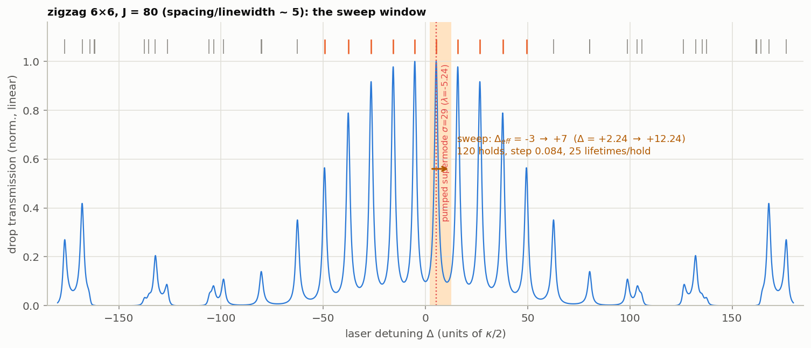

# Topological frequency comb: nonlinear states of the zigzag 6×6 lattice

Nonlinear solutions of the coupled-ring (Haldane-type AQH) lattice LLE, found by
experiment-style detuning sweeps, together with everything needed to pick any of them up and
keep computing — on any machine, with nothing but this repo.

## Using the states (start here)

`states/states.npz` holds the field of every catalogued state (one `(R, N)` complex frame,
0.8 MB for all 13); `states/states.json` holds the parameters that keep each one alive and a
fingerprint to verify it loaded correctly.

```bash
pip install -r requirements.txt        # torch, numpy, matplotlib
python topo_comb_seed/states/load.py --list                     # the catalogue
python topo_comb_seed/states/load.py --check                    # re-derive every fingerprint
python topo_comb_seed/states/load.py nested_soliton_P6500_D6.60 --evolve 60 --plot portrait.png
```

```python
from topo_comb_seed.states.load import load_state
a, sol, meta = load_state("nested_soliton_P6500_D6.60")   # torch (1, R, N) + ready solver
a, mean_I = sol.evolve(a, 20_000, accumulate=True)        # ... and carry on
```

The solver comes back already carrying that state's detuning and drive, so the state is
stationary (or exactly periodic, if travelling) under `sol.evolve`. Pass `F0_squared=` /
`Delta_eff=` to `load_state` to walk a state somewhere else in parameter space. Field
convention: `a[r, mu]` is the longitudinal-mode amplitude, `psi_r(phi) = ifft(a[r],
norm="forward")`.

| state | F₀² | Δ_eff | envelopes | what it is |
|---|---|---|---|---|
| `linear_P500_D1.00` | 500 | 1.00 | 0 | below threshold — linear reference |
| `minicomb_P3500_D1.40` | 3500 | 1.40 | — | locked mini-comb candidate (nesting unproven) |
| `chaos_P3500_D3.10` | 3500 | 3.10 | — | developed MI chaos |
| `cw_P3500_D4.80` | 3500 | 4.80 | 0 | CW branch (cold start) |
| `turing3_P3500_D4.80` | 3500 | 4.80 | 3 | edge-uniform Turing-3, k = 0 |
| `soliton2_P3500_D4.90` | 3500 | 4.90 | 2 | two stationary pulses |
| `soliton1_P3500_D4.90` | 3500 | 4.90 | 1 | **single stationary soliton** (k = 0, not nested) |
| `chaos_P6500_D1.00` | 6500 | 1.00 | — | chaos owns the blue side at this pump |
| `chaos_P6500_D4.50` | 6500 | 4.50 | — | chaos just before the collapse |
| `gas_P6500_D5.50` | 6500 | 5.50 | ~10 | dense soliton gas (metastable) |
| `gas_P6500_D5.90` | 6500 | 5.90 | ~9 | edge soliton gas |
| `crystal_P6500_D6.30` | 6500 | 6.30 | ~5 | nested soliton crystal |
| **`nested_soliton_P6500_D6.60`** | 6500 | 6.60 | **1** | **single nested travelling edge soliton** |
| `cw_P6500_D6.90` | 6500 | 6.90 | 0 | CW, one step past the shelf |

Lattice (identical for all): zigzag 6×6 AQH, R = 60 rings, J = 80, φ = π/4, spin +1,
d₂ = 0.0125, κ_ex = 1, N = 64 longitudinal modes, dt = 0.0025, pump ring 0, drop ring 55,
pumped edge supermode σ = 29 (λ = −12.66). Units κ_in = κ/2 = 1, time in lifetimes 2/κ.

## What is in this folder

- `states/` — the portable archive (`states.npz`, `states.json`), `load.py` (loader/CLI) and
  `build_states.py` (provenance: which raw run each frame came from).
- `STATES.md` — the full catalogue: every state, its signature, its seed, how it was verified,
  plus the negative results (which hunts failed and why).
- `figures/` — every figure and movie, one folder per pump power (`P500`, `P3500`, `P6500`).
- Sweep & analysis tools: `sweep.py` (detuning ramp), `pumpsweep.py` (pump-mode/comb power),
  `verify.py` (stop-and-hold), `summary.py`, `stairplot.py`, `waterfall.py` (stack several
  pump powers), `nested_mu.py`, `nested2d.py`, `threshold.py`.
- State preparation: `surgery.py` (carve pulses in φ — this is what made the single stationary
  soliton out of Turing-3), `redwalk.py` (adiabatic continuation in detuning).
- Figures & movies: `animate_state.py` (2D portrait + circulation movie of any saved state,
  and it runs straight off `states/states.npz`), `portrait2d.py` (formation movie of the
  stationary soliton).

The raw sweep data (~10 GB of `runs/`) is deliberately **not** in the repo — the state frames
above are the part worth carrying, and every figure can be rebuilt from them.

## RESULT (2026-10-05, evening): SINGLE NESTED TRAVELLING EDGE SOLITON — FOUND

zigzag 6×6, J = 80, **F₀² = 6500, Δ_eff = +6.60** (STATES.md #15). ONE envelope localised in
*both* directions — ~3 boundary rings wide along the edge, a single sharp φ-pulse inside each —
circulating the 20-ring boundary once every 0.55 lifetimes (36 rings/lt, one chirality, zero φ-drift),
passing the drop port once per lap (clean periodic drop-power sawtooth). Fine spectrum: rigid
equidistant comb across ALL teeth μ — the nested 2D-comb signature. Verified 1100 lifetimes
(300 + 800), amplitude constant. **Cold-sweep accessible, no surgery needed**: seed
`runs/P6500/sweep_P6500_J80_fine.npz:snap_+6.60`.

How it was found: a fine sweep (ΔΔ_eff = 0.025) at F₀² = 6500 resolved the post-collapse shelf
Δ ∈ [5.6, 6.9] into a soliton staircase — envelope count **9 (Δ5.9, soliton gas) → 5 (Δ6.3,
soliton crystal) → 1 (Δ6.6) → 0 (CW, Δ6.9)**. The twelve surgical routes that failed at
F₀² = 8000 failed because that staircase's last step is 2 (corner-pinned pair); at 6500 the
last step is 1. Portrait & circulation movie: `runs/P6500/nested_soliton_2d.png`, `.gif/.mp4`.

## Earlier result (same day): single STATIONARY k=0 soliton — FOUND

zigzag 6×6, J = 80, F₀² = 3500, Δ_eff = +4.9 (pumped edge supermode σ = 29). One sech-like
pulse per boundary ring, all rings phase-rigid (peak/background ≈ 16), stationary for 800+
lifetimes with power drift at machine precision, single fine line per tooth (rigidly
co-rotating with the pump). **Power quantisation:** CW 12.65 → 1 pulse 16.12 → 2 pulses
19.80 → 3 pulses 23.51 — ≈ 3.6 per pulse; the four states coexist (multistable branch,
alive for Δ_eff ∈ [≈4.2, 5.20], dies to CW at 5.25).

Preparation path (all reproducible from `runs/`): blue→red ramp ignites MI chaos
(`sweep.py`, F₀² = 3500) → chaos collapses onto the locked Turing-3 branch at Δ_eff ≈ 4.1
(history-dependent: a cold start falls to CW — `verify.py` cold vs `--init` warm) → red
walk confirms the branch and its end (`redwalk.py`) → **pulse surgery** (`surgery.py`:
mask 2 of 3 pulses, keep the per-ring CW background) → relaxation locks the single pulse.
Final portrait: `runs/verify_F23500_D+4.90_SOLITON.png`.

Honest scope note: this soliton is *uniform along the boundary* (every edge ring carries the
same pulse — a k = 0 collective state; the fine spectrum is a single line, the edge ladder is
not lit). The travelling, boundary-localised **nested** soliton of Mittal et al. was the
remaining target — found later the same day at F₀² = 6500 (see RESULT above).

Goal: a **single nested temporal soliton** on the zigzag lattice — the Mittal et al. 2021
object — reached the way an experiment reaches it: a pump-detuning sweep from blue to red
across the edge band, through nested Turing rolls and chaos onto the soliton step.

## The sweep window



Default coarse sweep (`sweep.py`, **J = 80, dt = 0.0025** — the resolved ladder,
spacing/linewidth ≈ 5): the effective detuning of the pumped edge supermode
($\sigma$ = 29, $\lambda$ = −5.24) is ramped $\Delta_{eff}$ = −3 → +7, i.e. laser detuning
$\Delta$ = +2.24 → +12.24 — from the blue side of its resonance, across it, and ~1 ladder
spacing into the red. **120 holds, step 0.084, 25 lifetimes per hold.** The shaded band on
the linear drop spectrum above shows exactly what the laser crosses; orange ticks are the
edge-supermode ladder. (J = 120 would give ratio ~7.5, but J·dt = 0.3 then needs dt below
0.0025; keep it in reserve.)

## Detuning sign convention — OPPOSITE to the Topological Photonics Explorer

This repo (LLE convention, `physics.md` C4): the linear term is $-(1+i\Delta)\psi$, i.e.

$$\Delta = \tfrac{2}{\kappa}\,(\omega_{res} - \omega_p)$$

**positive $\Delta$ = laser *below* resonance (red-detuned); a blue→red sweep means
$\Delta$ increasing.**

The explorer (`NonLinear.py`): the linear term is $+(i\delta - \kappa/2)a$, i.e.
$\delta = \tfrac{2}{\kappa}(\omega_p - \omega_{res}) = -\Delta$: **positive $\delta$ = laser
*above* resonance (blue); the same blue→red sweep is $\delta$ decreasing.** So our ramp
$\Delta_{eff} = -3 \to +7$ is the explorer's $\delta = +3 \to -7$, and any detuning value
quoted from one code must be sign-flipped before use in the other (this also flips the sign
of every supermode eigenvalue's apparent position on the detuning axis: a resonance at
$\lambda$ sits at $\Delta = -\lambda$ here but at $\delta = +\lambda$ there).

The unambiguous anchor when in doubt: state which way the *laser frequency* moves. Solitons
live on the side where the laser is below the (Kerr-shifted) resonance — $\Delta > 0$ here,
$\delta < 0$ in the explorer.

## Protocol (the staircase)

Pump only (no encoding tones), on the central edge supermode sigma_p of the zigzag lattice,
all N longitudinal modes live. Ramp the effective detuning Delta_eff of that supermode from
blue to red while recording:

1. **power trace** — total intracavity power and drop-ring power vs Delta_eff: the soliton
   announces itself as a sharp *step* on the red side;
2. **regime snapshots** — at chosen detunings, a short time trace a(t) for
   - the nested spectrum: per-longitudinal-tooth slow-time FFT (fine lines at the edge
     supermode ladder) — rolls: few phase-locked fine lines; chaos: filled; soliton:
     sech^2 envelope over the fine lines of every tooth,
   - the phase y-cut at fine-line frequencies (locked = flat), and
   - the real-space picture: |psi_r(phi)|^2 along the boundary rings — the nested soliton is
     a pulse in phi times a pulse travelling around the boundary.

## Success criteria ("elegant")

- a clean power step whose plateau survives a hold of >= 500 lifetimes;
- ONE pulse around the boundary (not a Turing train), sech^2-like fine-comb envelope;
- phase-locked fine lines (drift < 1e-3 over the hold);
- reproducible from a detuning ramp (not only from a seeded ansatz).

## Knobs

- lattice: zigzag 6x6, 10-rung edge ladder. Default J = 80, dt = 0.0025: mini FSR ~10.6,
  spacing/linewidth 4.8-5.4 — resolved, overlap-free (J = 40 gave 2.4-2.7 and visibly
  overlapping tails; J = 120 gives ~7.5 but needs dt < 0.0025).
- pump F0^2: the superring spreads the pump over ~n_edge rings, so single-ring soliton
  existence (F^2 ~ 3-10 per ring at Delta_eff ~ 2-4) suggests F0^2 ~ O(100-800). Scan.
- d2 = 0.0125 anomalous (fast-time soliton needs it); the slow (edge) dispersion is set by
  the ladder's deviation from equidistance — the zigzag's +-5% is why it was chosen.
- ramp rate: slow enough to be adiabatic w.r.t. the photon lifetime (hold >= 20 lifetimes
  per detuning step), fast-scan tricks only if multistability demands them.

## Reproducing a figure from scratch

Each pump power is one sweep plus its diagnostics; outputs land in `runs/P{F₀²}/`:

```bash
python topo_comb_seed/sweep.py     --F2 6500 --start 0 --stop 7 --steps 280 \
                              --snap 5.5 5.9 6.3 6.6 6.9 7.5 --tag fine
python topo_comb_seed/pumpsweep.py --F2 6500 --start 0 --stop 7 --steps 280 --tag fine
python topo_comb_seed/summary.py   topo_comb_seed/runs/P6500/sweep_P6500_J80_fine.npz --rownorm
python topo_comb_seed/stairplot.py topo_comb_seed/runs/P6500/pumpmode_P6500_fine.npz
python topo_comb_seed/verify.py    --F2 6500 --target 6.6 --T_hold 300 \
    --init "topo_comb_seed/runs/P6500/sweep_P6500_J80_fine.npz:snap_+6.60" --tag shelf66
python topo_comb_seed/animate_state.py --F2 6500 --de 6.6 --step_lt 1.0 --nfr 95 \
    --init "topo_comb_seed/runs/P6500/verify_P6500_D+6.60_long.npz:trace" \
    --out topo_comb_seed/runs/P6500/nested_soliton --label "single nested soliton"
```

`animate_state.py` also runs straight off the archive — give it `states/states.npz:<state>`
as `--init` and no raw run data is needed.
